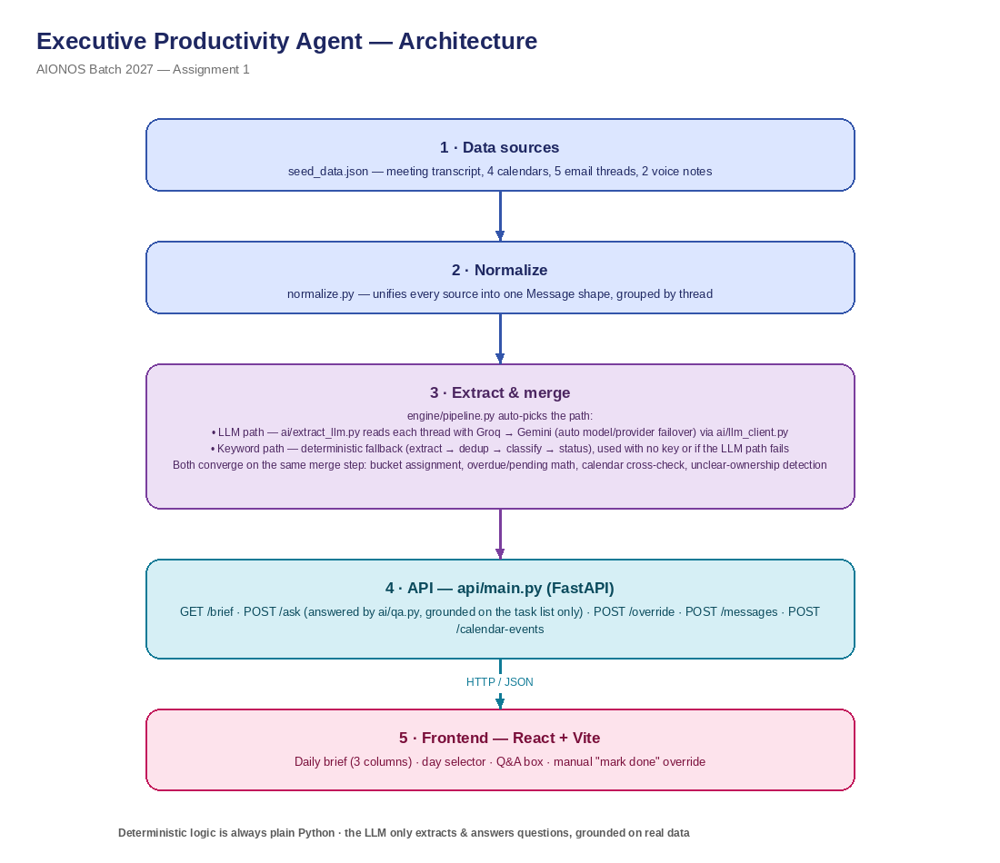

# Executive Productivity Agent — Assignment 1 (AIONOS)

Turns Arjun Malhotra's messy inputs (a meeting transcript, 4 calendars, 5 email
threads, 2 voice notes) into a daily action brief: what he owes, what he's
waiting on, and what nobody has claimed ownership of — plus a Q&A layer for
questions like "What did I promise Raghav?".

## Quick start

**Backend (FastAPI):**
```bash
cd backend
pip install -r requirements.txt
cp .env.example .env        # optional: add GROQ_API_KEY and/or GEMINI_API_KEY for LLM-powered Q&A
uvicorn api.main:app --port 8000
```

**Frontend (React + Vite), in a second terminal:**
```bash
cd frontend
npm install
npm run dev
```
Open the URL it prints (default `http://localhost:5173`). It calls the API
at `http://127.0.0.1:8000` by default — override with a `.env` file (see
`frontend/.env.example`) if you run the backend on a different port.

Without `GROQ_API_KEY` or `GEMINI_API_KEY` set, the Q&A layer falls back to
a small keyword-based matcher and the app still works end-to-end — useful
for a zero-dependency demo. With one or both keys set, `/ask` is answered
by an LLM (Groq tried first, Gemini as automatic fallback if Groq fails
for any reason — rate limit, quota, error), grounded strictly on the
already-deduplicated task list (see "AI used at runtime" below).

## Architecture



```
seed_data.json (transcript + calendars + emails + voice notes, structured)
        |
        v
normalize.py     -> unifies all sources into one Message shape, grouped by
                     thread (context)
        |
        v
  +-------------------------- two extraction paths ---------------------------+
  |                                                                            |
  |  LLM path (used whenever a Groq/Gemini key is configured)                 |
  |  ai/extract_llm.py   -> one call per THREAD (not per message): reads the  |
  |                         whole thread and resolves it to its CURRENT state |
  |                         (topic, real actor, deadline, resolved?), reusing |
  |                         topic_keys from a persisted registry              |
  |                         (data/topic_registry.json) instead of a fixed     |
  |                         keyword list. Cached per-thread                   |
  |                         (extraction_cache.json) so re-running only        |
  |                         reprocesses threads with NEW messages — cost and  |
  |                         latency stay flat as more emails/transcripts get  |
  |                         added over time. Every record is Pydantic-        |
  |                         validated and must cite real message ids or it's  |
  |                         dropped — never trusted un-grounded.              |
  |  engine/merge_llm.py -> deterministic merge across threads (group by      |
  |                         topic_key+actor, latest wins, full history kept), |
  |                         bucket assignment, overdue/pending math, and      |
  |                         GENERIC unclear-ownership (any topic nobody ever  |
  |                         claims, not just the lease). Also cross-          |
  |                         references calendars (engine/calendar_check.py):  |
  |                         matches a task to a real calendar entry as        |
  |                         corroborating evidence, and flags proposed times  |
  |                         that collide with someone's Blocked slot.         |
  |                                                                            |
  |  Keyword path (used with no key configured, AND as an automatic fallback  |
  |  if the LLM path errors for any reason — a live demo should never break   |
  |  because of a flaky API call)                                             |
  |  extract.py + dedup.py + classify.py + status.py -> the original fixed    |
  |  keyword-taxonomy pipeline: object keywords, a deadline-phrase list,      |
  |  resolution-keyword matching, and a hardcoded lease-only unclear-         |
  |  ownership case. 100% deterministic, zero API dependency, zero latency.   |
  |                                                                            |
  +----------------------------------------------------------------------------+
        |
        v
pipeline.py      -> picks a path automatically (build_tasks()), returns the
                     final Task list plus which path actually ran
        |
        v
api/main.py (FastAPI)  ->  GET  /brief?as_of=YYYY-MM-DD
                            POST /ask {question, as_of}
                            POST /override {task_id, value, note}
                            POST /messages {..}         — append a new
                                                           message; only its
                                                           thread gets
                                                           reprocessed
                            POST /calendar-events {..}  — append a calendar
                                                           entry for a person
        |
        v
frontend/  -> daily brief (3 columns), day selector, Q&A box, manual
              "mark done" override for tasks with no textual confirmation
```

## Why deterministic logic + a narrow, generalizing LLM slice (not "just ask an LLM")

Matching, merging, bucketing, and overdue math are always plain Python,
never an LLM call — every task in the brief traces back to specific message
IDs (`evidence` field), on both extraction paths. The LLM's job stays
narrowly scoped to the parts that genuinely need open-ended language
understanding: reading a thread to figure out who committed to what
(`ai/extract_llm.py`), and turning a free-form question into an answer
grounded strictly on the already-deduplicated task list (`ai/qa.py`).
Neither can invent a fact that isn't traceable to a real message id.

Extraction started as a fixed keyword taxonomy (still present as
`engine/extract.py`, and kept as the offline/fallback path). Deliberate
stress-testing — writing adversarial synthetic emails, voice notes, and
transcripts designed to break generalization — surfaced real failure modes
a fixed keyword list can't fix: two unrelated topics colliding on a
generic word like "reschedule" or "sign off"; a second unowned topic
besides the hardcoded lease case silently vanishing from the brief instead
of surfacing as unclear ownership; quoted/reported speech ("Neha said
she'll...") getting attributed to the wrong person; negation ("I will not
be able to...") being read as a positive commitment; deadline phrases
outside a fixed list being silently dropped. The LLM extraction path fixes
all of these by actually reading the sentence, while the keyword path
stays as the deterministic, zero-dependency fallback — including an
automatic mid-run fallback if every LLM call in a build fails (bad key,
both providers down), so a flaky API never means a broken or empty brief.

**Built for data that keeps arriving, not just this fixed pack**: the
topic registry persists across runs so the same real-world topic always
gets the same `topic_key`, even in a new thread weeks later. Per-thread
caching means adding one new email only reprocesses that email's thread,
not the whole history. `POST /messages` and `POST /calendar-events` let
new data be appended live without a restart.

## Key design decisions / assumptions

- **Topic carry-over within a thread**: a reply that doesn't repeat the
  topic noun (e.g. Divya's "I'll have it ready Wednesday evening") is tied
  to the right task via the message's `context` (thread/subject) field,
  the same way a person reading an email thread infers what "it" refers to.
- **Unclear ownership is a separate bucket from "waiting on others"**, not
  folded into it — the latter implies a known owner; conflating them would
  mean the agent silently assumes an owner it was never given. The Mumbai
  lease is the seed data's example: flagged by Raghav, declined by Arjun
  and Divya, never claimed by Facilities. On the LLM path this detection is
  generic — any topic that's discussed and never claimed surfaces here, not
  just the lease (the keyword path's fallback detection is still lease-
  specific, since it has no general language understanding to lean on).
- **A task is "done" only with explicit resolution evidence** (a later
  message confirming delivery), never just because its deadline passed.
  The vendor list is a deliberate test of this: it has no resolution
  message anywhere in the data, so it correctly stays overdue rather than
  silently defaulting to done.
- **Manual override**: when the engine finds no textual confirmation, the
  user can mark a task done themselves via the UI. This is stored
  separately from the engine's own inferred status (`auto_status` field)
  so the brief can stay honest about what was actually detected vs.
  manually confirmed — see each task's `override_note`.
- **Voice notes are treated as Arjun's own commitments/open items**, same
  as his meeting statements — not instructions from someone else, per the
  data pack's explicit note.
- **`as_of` simulates "today"** since the exercise is frozen in the week of
  21–25 Sept 2026; the UI's day selector lets a reviewer see the brief
  change day to day (e.g. the vendor list flips from pending to overdue
  between Tue and Wed).
- **Facilities' broadcast emails** are included only because they're
  directly relevant to a task already surfaced elsewhere (the lease); the
  agent doesn't extract commitments from general "All Staff" broadcasts.

## AI used at runtime

- **Groq and Gemini APIs**, optional at runtime, with automatic failover:
  power both `ai/extract_llm.py` (reading threads into structured
  commitment records) and `ai/qa.py` (answering free-form questions,
  grounded on the structured task list only). Groq is tried first; if that
  call fails for any reason (rate limit, quota exceeded, network error), it
  automatically retries with Gemini instead. *Within* each provider, a
  lighter fallback model on the same key is also tried before moving to
  the next provider (`llama-3.1-8b-instant` under Groq;
  `gemini-3.5-flash-lite` under Gemini) — both
  providers' free tiers meter request quota **per model**, not per
  account, so a 429 on the primary model still leaves a fallback model
  with its own full daily allowance. Falls back to keyword-based logic on
  both fronts if every model of every configured provider fails, so the
  app is fully demoable offline. Q&A answers are also cached in-process
  per (question, as_of, task-list state) so repeated/duplicate questions
  during manual testing don't re-burn quota — extraction was already
  cached per-thread to disk.

## What's not built out further (given the 6-hour scope)

- No persistent database — tasks are recomputed from `seed_data.json` +
  the topic registry/extraction cache on disk, and kept in memory per
  `as_of` view (overrides persist across views within a running session).
- No auth — single-user prototype for Arjun only, per the assignment.
- Calendar cross-referencing is best-effort keyword/interval matching
  (`engine/calendar_check.py`), not a full scheduling engine — it flags
  likely conflicts and matching events as context, not a guarantee.
- The per-thread cache and topic registry are plain JSON files, fine for
  this scope; a multi-user production version would want a real database
  and per-user registries instead of one shared file.
